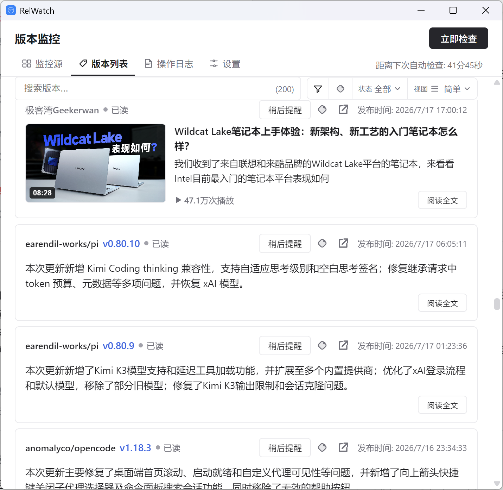

# RelWatch

GitHub Release 监控桌面应用，使用 DeepSeek 开发。支持 GitHub / Hugging Face / YouTube / 哔哩哔哩多源监控，内置 DeepSeek AI 摘要与全文翻译。

## 功能

### 多源监控

| 功能 | 说明 |
|------|------|
| 自动轮询 | 定时检查监控源更新，轮询周期可配置 |
| GitHub 仓库 | 监控 Release 更新，支持预发布过滤与完整分页拉取历史版本 |
| Hugging Face 组织 | 监控模型发布，展示 pipeline_tag / downloads / likes 等元数据徽标 |
| YouTube 频道 | RSS 与 Data API v3 双模式，支持按内容类型订阅，显示播放量 |
| B 站 UP 主 | 基于 web-dynamic 接口（WBI 签名）拉取动态，支持 Cookie 一键登录 |

### 版本浏览

| 功能 | 说明 |
|------|------|
| 聚合视图 | 多源版本流统一聚合，支持搜索、按状态（未读/已读）与来源类型筛选、排序 |
| 日历视图 | 按日期热力图展示发布记录，重要程度以语义色区分 |
| 版本详情弹窗 | Markdown 渲染、图片复制、外链守卫、拖拽调整大小、上/下一版本导航 |
| 虚拟滚动 | 长列表流畅滚动，Markdown 渲染带缓存 |

### AI 能力（DeepSeek）

| 功能 | 说明 |
|------|------|
| 自动摘要 | 轮询发现新版本时自动生成更新摘要，按重要性分级 |
| 全文翻译 | 摘要 / 译文 / 原文三视图切换，可选自动翻译 Release Notes |
| 灵活配置 | 模型、Prompt、非官方 API 地址均可配置；支持 HTTP 代理，AI 请求可独立设置代理 |

### 应用体验

| 功能 | 说明 |
|------|------|
| 桌面通知 | Windows / macOS / Linux 系统通知 |
| 系统托盘 | 关闭窗口时最小化到托盘，后台运行 |
| 开机自启 | Windows（注册表）/ macOS（launchd）/ Linux（.desktop） |
| 批量管理 | 监控源搜索、排序、批量暂停 / 恢复 / 静默 / 删除 |
| 多语言 | 中文 / English |
| 主题切换 | 浅色 / 深色一键切换 |
| 操作日志 | 本地日志页，可配置保留天数 |
| 备份导出 / 导入 | 导出含时间戳与主机名的备份文件，支持导入恢复 |
| 功能统计 | 可选的使用埋点，本机存储，开发者面板可查看 |

### 安全

| 功能 | 说明 |
|------|------|
| 凭据加密 | GitHub Token、API Key 经系统凭据存储加密保存 |
| 外链守卫 | 打开外部链接与下载前二次确认，防误触 |
| SSRF 防护 | 下载前校验目标为公网地址，拒绝私网 / 回环 / 保留地址 |

## 安装 & 使用

从 [GitHub Releases](https://github.com/hhelibeb/relwatch/releases/latest) 页面下载对应平台的安装包（Windows NSIS / Linux deb、AppImage），安装后在「监控源」中添加想要监控的仓库、组织、频道或 UP 主即可。

## 界面



## 技术栈

Tauri v2 · Rust · Vue 3 · TypeScript · SQLite · pnpm

## 快速开始

```bash
pnpm install
pnpm run tauri dev    # 桌面开发模式
pnpm run test         # 运行前端测试
pnpm run tauri build  # 构建安装包
```

## License

MIT
