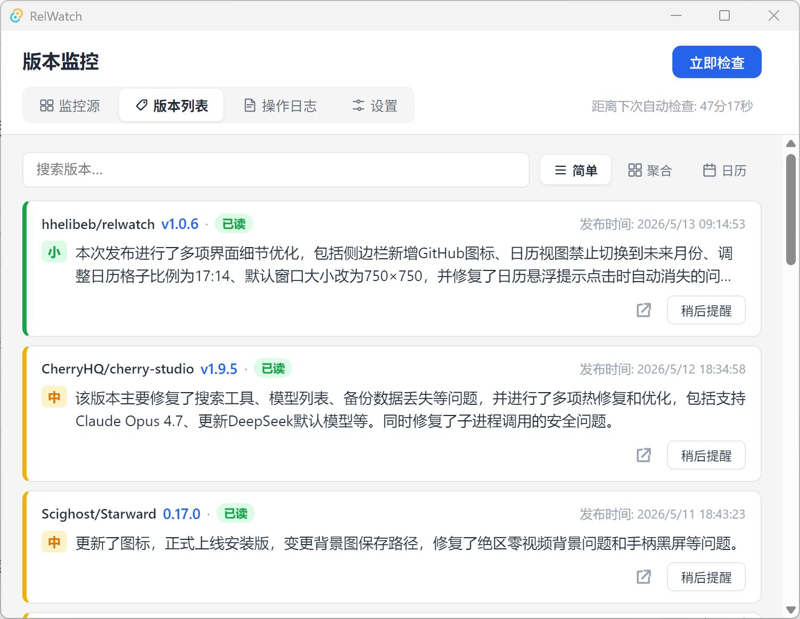

# RelWatch

GitHub Release 监控桌面应用，使用 DeepSeek 开发。

## 功能

| 功能 | 说明 |
|------|------|
| 自动轮询 | 定时检查监控源的版本更新 |
| 桌面通知 | 发现新版本时弹出系统通知 |
| AI 摘要 | 集成 DeepSeek API，自动生成版本更新摘要 |
| 系统托盘 | 关闭窗口时最小化到托盘，后台运行 |
| 开机自启 | Windows/Linux 开机自动启动，启动后最小化到系统托盘 |
| 代理支持 | 支持 HTTP 代理，AI 请求可独立配置 |
| 多语言 | 中文 / English |
| 安全存储 | GitHub Token、API Key 加密存储 |
| 批量操作 | 监控源支持搜索、排序、批量选择与批量暂停/恢复/静默/删除 |
| 历史版本拉取 | 支持完整分页拉取所有历史 Release，不受上限限制 |
| 主题切换 | 浅色/深色主题一键切换 |
| 备份导出/导入 | 导出含时间戳和主机名的备份文件，支持导入恢复 |

## 安装 & 使用

从 [GitHub Releases](https://github.com/hhelibeb/relwatch/releases/latest) 页面下载安装包安装，在监控源中添加想要监控的repo即可。

## 界面



## 技术栈

Tauri v2 + Rust + Vue 3 + TypeScript + SQLite

## 快速开始

```bash
pnpm install
pnpm run dev           # 开发模式
pnpm run tauri build   # 构建安装包
```
